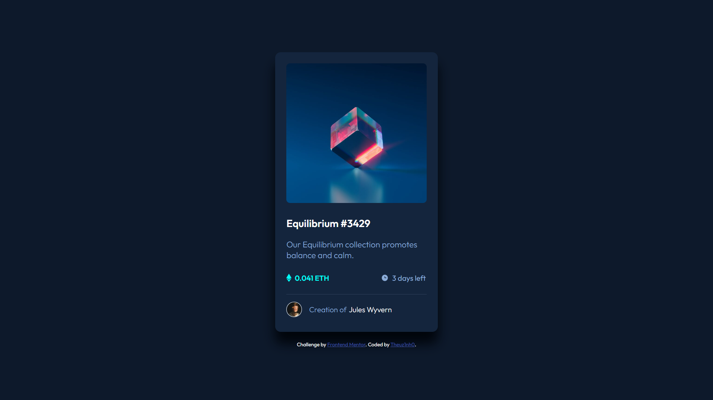

## Table of contents

- [Overview](#overview)
  - [The challenge](#the-challenge)
  - [Screenshot](#screenshot)
  - [Links](#links)
- [My process](#my-process)
  - [Built with](#built-with)
  - [What I learned](#what-i-learned)
- [Author](#author)

## Overview

### The challenge

Users should be able to:

- View the optimal layout depending on their device's screen size
- See hover states for interactive elements

### Screenshot



### Links

- Solution URL: [solution URL](https://github.com/Theuz1nh0/NFT-preview-card-component)
- Live Site URL: [live site URL](https://theuz1nh0.github.io/NFT-preview-card-component/)

## My process

### Built with

- Semantic HTML5 markup
- Flexbox

### What I learned

```css
main {
    max-width: 21.875rem;
    width: 100%;
}
```
```css
#link-image:active::after {
    align-items: center;
    background-color: hsla(178, 100%, 50%, 0.5);
    border-radius: 8px;
    content: url(./images/icon-view.svg);
    display: flex;
    height: 98.6%;
    justify-content: center;
    left: 0;
    position: absolute;
    top: 0%;
    width: 100%;
}
```

## Author

- Frontend Mentor - [@Theuz1nh0](https://www.frontendmentor.io/profile/Theuz1nh0)
- Linkedin - [@mateus-moura-domingos-462607243](https://www.linkedin.com/in/mateus-moura-domingos-462607243/)
